# Build Guide

こちらは Yubino Hara のビルドガイドになります。

## 部品

| 名前                 | 数   | 備考              |
| :------------------- | :--- | :---------------- |
| 四本指PCB            | 2枚  |                   |
| 親指PCB              | 2枚  |                   |
| RP2040-zero          | 2枚  |                   |
| TRRSジャック         | 2個  |                   |
| ダイオード           | 46個 |                   |
| PCBソケット          | 44個 | Kailh Choc v1     |
| TRRS(4極)ケーブル    | 1本  | 別売              |
| USB type-Cケーブル   | 1本  | 別売              |
| 粘着付きコルクシート | 4枚  |                   |
| SK6812MINI-E         | 44個 | Back light用 LEDs |

## 組み立て

次の順番で行います

1. 裏面はんだ付け
   1. ダイオード
   2. PCBソケット
   3. LED
2. 表面はんだ付け
   1. TRRSソケット
   2. ピンヘッダ
   3. ピンソケット
   4. RP2040-zero

### PCBチェック

基板は左右共通ですので、まずは図のように並べて左右が入れ替わらないようご注意ください。

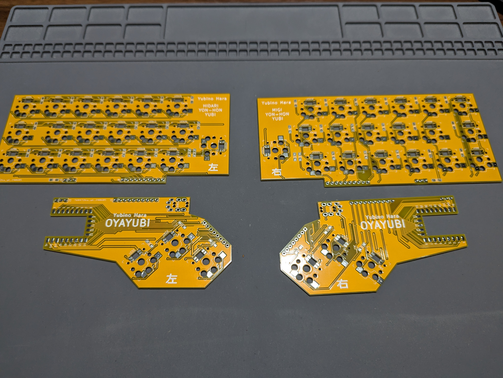

確認できましたら、まずは裏面のはんだ付けを行います。

基板を裏返してから、次の工程をご確認ください。

### 裏面はんだ付け：ダイオード

ダイオードには向きがあります

端っこに白い線｜があります。この線を↓

　

→基板上のダイオードのマークの▷|の線に合わせるようにはんだ付けしてください。

　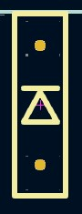

###### ～～ダイオードつけるコツとか入れる～～

###### ～～予備ハンダについて書く～～

### 裏面はんだ付け：PCBソケット

PCBソケットにもダイオードと同じように向きがあります

左側は丸く、右側は四角くなってます

　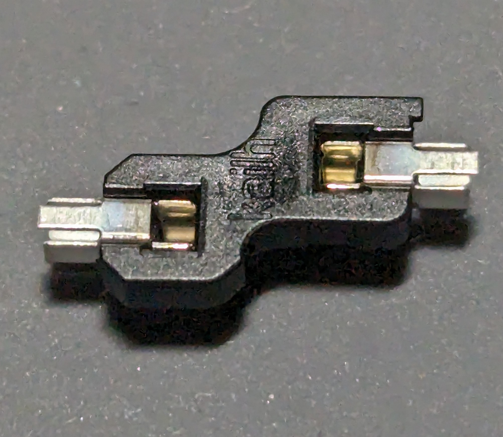

丸い方と四角い方を、基板のマークに合わせてはんだ付けしてください

　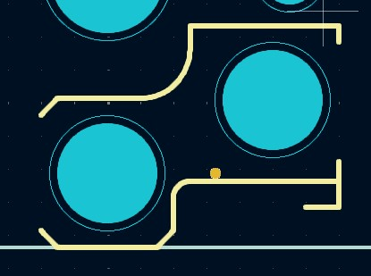

左手側の基板の裏面に、ダイオードとPCBソケットをつけ終わった図がこちらです。

四本指

　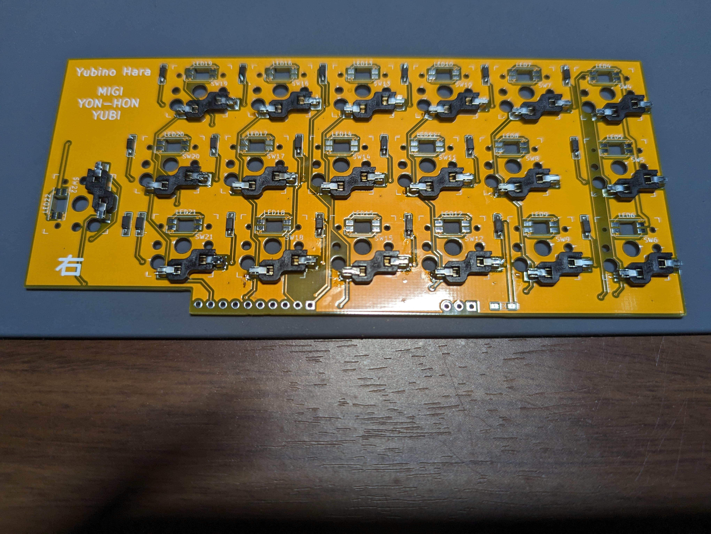

親指

　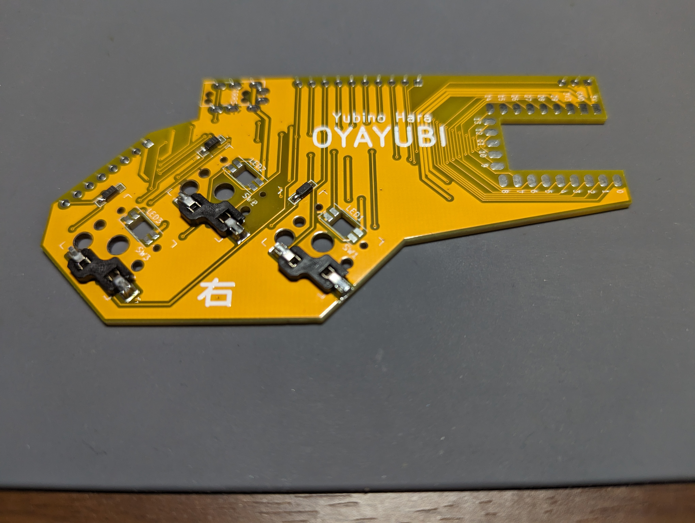

### 裏面はんだ付け：LED

LEDは裏面からはんだ付けをして、表面に向ける必要があります。

そのためはんだ付けの際はひっくり返してつけるようにお願いします。

###### ～～LEDの部品写真か図～～

左下に見える直角のところに、足のかけた部分が向くようにはんだ付けしてください

　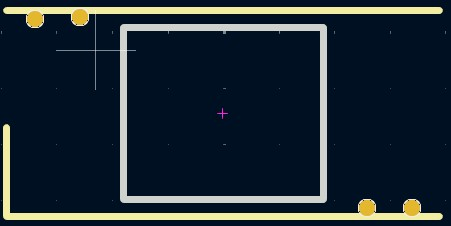

#### 注意：

LEDは熱に弱いため、長時間の加熱は避けてください

不安な場合は、足を一本つけ終わったら別のLEDの足をつけるなどして、冷ます時間を設けてください

LEDをつけおわった図

###### ～～LEDつけたあとの裏面写真～～

### 表面はんだ付け：TRRSソケット、ピンヘッダ

表側から差し込んで、裏側からはんだ付けしてください

取り付け後の図（表面）

### 表面はんだ付け：ピンソケット

ピンヘッダにピンソケットをさし込み、更に上から四本指基板の穴にピンソケットの足をさし込みます。

このとき四本指基板が傾きますが、そのままで問題ありません。

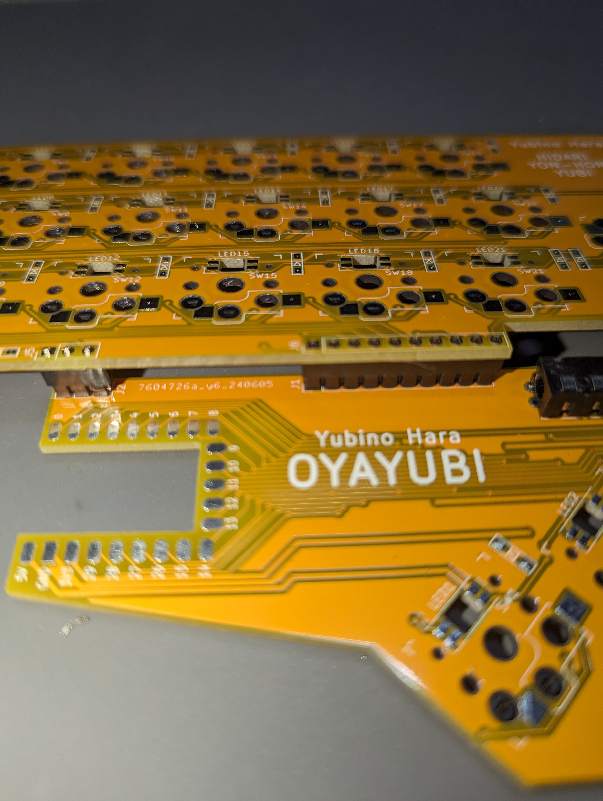

横から見ると、このように傾いてます

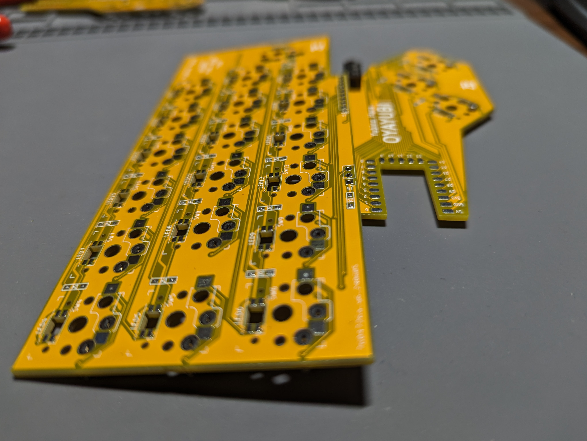

### 表面はんだ付け：RP2040-zero

RP2040は端面するーホールになっており、表面実装が可能です。

Yubino Haraは表面実装でRP2040を取り付けます。

位置がわかりにくいですが、概ねこのぐらいの見え方の位置につけると安定します。

　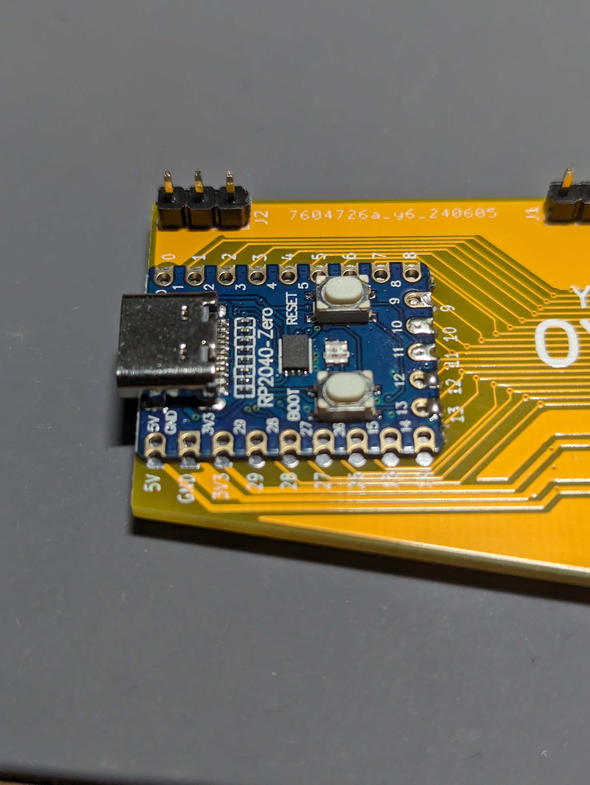

位置決めが難しいため、もし不安がある場合は

クリップや洗濯バサミなどで挟んで位置決めしてしまうのも手です

## ファームウェアインストール

こちらからファームウェアをダウンロードしてください

https://github.com/nagmeal/sep-sep-kbd/blob/main/yubino-hara/firmware/yubino_hara_v2_4.uf2

PCとキーボードをUSBケーブルで繋ぎます。

PCに外付けドライブとして認識されるので、そのままそこに

ダウンロードしたファームウェアをコピー＆ペーストしてください

もし外付けドライブとして認識されない場合は、RP2040のBootボタンを押しながらPCと接続してください

### 動作確認

動作確認は左手側はUSBケーブルでPCとつなぎ、左手側と右手側をTRRSケーブルで接続させて行います。

動作確認には、https://config.qmk.fm/#/test が便利です。

ジャック等の不良等もありえるので、片方ずつではなく必ず左右を接続させてから動作確認をしてください。

ここまで正しくできていれば、

PCBソケットのパットをピンセット等でショートさせるとキーが入力されます。

以上で基板は完成です。

### 裏面：コルクカットと貼り付け

添付のコルクを切り出して、クッション代わりに貼り付けます。

部品と干渉しないように気をつけてください

参考画像のように切り込みと貼り付けを行えば、

おおむね全体的にカバーできます。

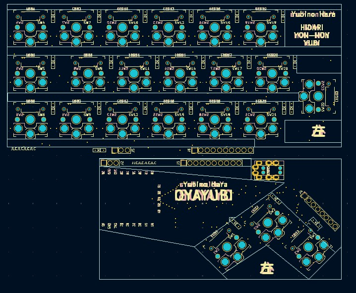