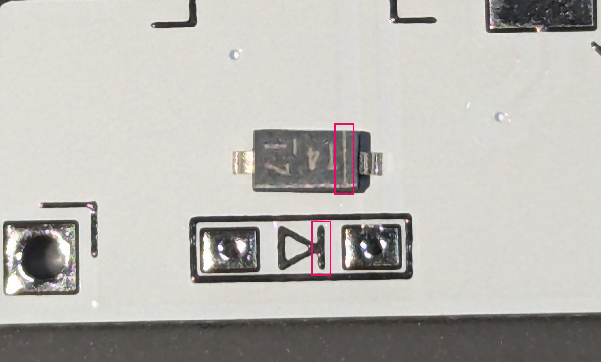

# Build Guide

こちらは Yubino Hara のビルドガイドになります。


## 部品

| 名前                 | 数   | 備考              |
| :------------------- | :--- | :---------------- |
| 四本指PCB            | 2枚  |                   |
| 親指PCB              | 2枚  |                   |
| RP2040-zero          | 2枚  |                   |
| TRRSジャック         | 2個  |                   |
| ダイオード           | 46個 |                   |
| PCBソケット          | 44個 | Kailh Choc v1     |
| TRRS(4極)ケーブル    | 1本  | 別売              |
| USB type-Cケーブル   | 1本  | 別売              |
| 粘着付きコルクシート | 4枚  |                   |
| SK6812MINI-E         | 44個 | Back light用 LEDs |


## 組み立て


次の順番で行います

1. 裏面はんだ付け
   1. ダイオード
   2. PCBソケット
   3. LED
2. 表面はんだ付け
   1. TRRSソケット
   2. ピンヘッダ
   3. ピンソケット
   4. RP2040-zero


### PCBチェック

基板は左右共通ですので、まずは図のように並べて左右が入れ替わらないようご注意ください。


確認できましたら、まずは裏面のはんだ付けを行います。

基板を裏返してから、次の工程をご確認ください。


### 表面実装部品のコツ：一箇所だけ先につける事と、予備はんだ

本キットではダイオード、LED、RP2040-zeroは表面実装になっています。

表面実装の部品をはんだ付けする場合、たくさんある部品の足のうち

一箇所だけを先にはんだ付けして位置決めをしてから、他の足をはんだ付けするときれいにつけやすいです。

またその際、あらかじめ基板に少量のはんだを乗せておく事（予備はんだ）で、

位置決めもやりやすくなります。


### ダイオード

ダイオードには向きがあります

端っこに白い線｜があります。この線を基板上の線と合わせるようにはんだ付けしてください

　


完成図（左手）


### PCBソケット

PCBソケットにもダイオードと同じように向きがあります

丸い方と四角い方を、基板のマークに合わせてはんだ付けしてください


完成図（左手）


### LED

#### 注意：

```
LEDは熱に弱い部品のため、
長時間加熱すると壊れる事があります。
ご注意ください。
```


LEDは裏面からはんだ付けをして、表面に向ける必要があります。

そのためはんだ付けの際はひっくり返してつけるようにお願いします。

左下に見える直角のところに、足のかけた部分が向くようにはんだ付けしてください


完成図（左手）


### ピンヘッダ、ピンソケット

基板を表に向けて並べてください

OYAYUBI側にピンヘッダ（トゲトゲが両方にある方）を差し込み**裏側から**はんだ付けをしてください

ピンソケット（トゲトゲが片方にしかない方）は　まだ**つけないで**ください


ピンソケットをピンヘッダに差し込み、穴に合わせてYON-HON YUBIの基板を乗せてください

少し斜めになりますが、斜めのまま **表面から** はんだ付けをしてください


### TRRSソケット

表面から差し込み、裏面からはんだ付けをしてください


### 表面はんだ付け：RP2040-zero

表側に設置し、表面からはんだ付けします。

位置決めが難しいため、テープや（柔らかい）クリップ等で固定してからはんだ付けすることをおすすめします。


完成図（左手）


## ファームウェア

### インストール

こちらからファームウェアをダウンロードしてください

https://github.com/nagmeal/sep-sep-kbd/blob/main/yubino-hara/firmware/yubino_hara_v2_4.uf2


PCとキーボードをUSBケーブルで繋ぎます。

PCに外付けドライブとして認識されるので、そこに

ダウンロードしたファームウェアをコピー＆ペーストしてください


もし外付けドライブとして認識されない場合は、RP2040のBootボタンを押しながらPCと接続してください


### 動作確認

動作確認は左手側はUSBケーブルでPCとつなぎ、左手側と右手側をTRRSケーブルで接続させて行います。

動作確認には、https://config.qmk.fm/#/test が便利です。


ジャック等の不良等もありえるので、片方ずつではなく必ず左右を接続させてから動作確認をしてください。

ここまで正しくできていれば、

PCBソケットのパットをピンセット等でショートさせるとキーが入力されます。


以上で基板は完成です。


## 仕上げ、ケース組付け

### コルクカットと貼り付け

添付のコルクを貼り付けていきます。

ニッパやカッターで簡単に切れるので、画像を参考に貼り付けてください。


### 滑り止めシール

画像を参考に貼り付けてください


### 組付け

OYAYUBI→YON-HON YUBIの順番にケースに組み付けて完成です

